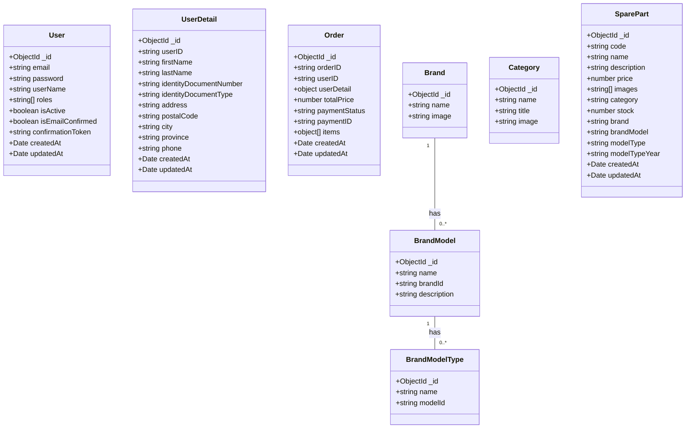

# Documentación de la Base de Datos

## Diagrama Entidad-Relación

Las únicas tablas relacionadas son:
- **Brand** → **BrandModel** → **BrandModelType**

El resto de las tablas (Category, Order, SparePart, UserDetail, User, Notification, File) no tienen relaciones directas entre entidades.
