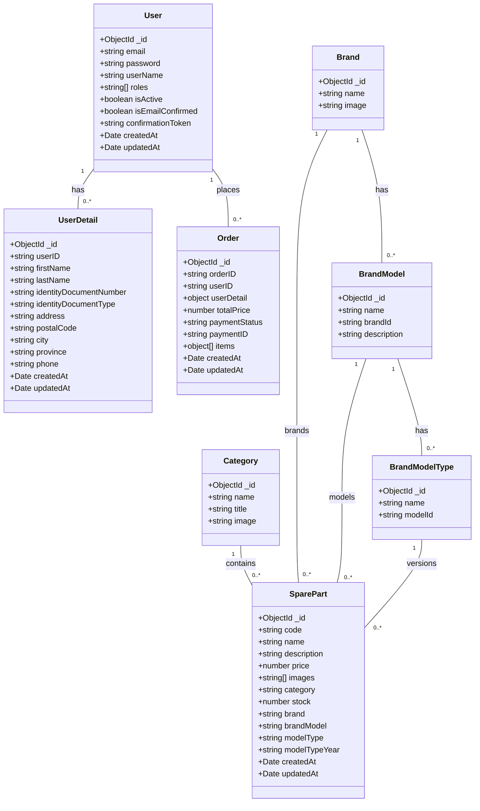

# Documentación de la Base de Datos

## Diagrama Entidad-Relación

## Descripción de las Relaciones

1. **User - UserDetail** (1:N)
   - Un usuario puede tener múltiples detalles de usuario
   - Clave foránea: `userID` en UserDetail

2. **User - Order** (1:N)
   - Un usuario puede tener múltiples órdenes
   - Clave foránea: `userID` en Order

3. **Brand - BrandModel** (1:N)
   - Una marca puede tener múltiples modelos
   - Clave foránea: `brandId` en BrandModel

4. **BrandModel - BrandModelType** (1:N)
   - Un modelo puede tener múltiples tipos/versiones
   - Clave foránea: `modelId` en BrandModelType

5. **Category - SparePart** (1:N)
   - Una categoría puede contener múltiples repuestos
   - Clave foránea: `category` en SparePart

6. **Brand - SparePart** (1:N)
   - Una marca puede estar asociada a múltiples repuestos
   - Clave foránea: `brand` en SparePart

7. **BrandModel - SparePart** (1:N)
   - Un modelo puede estar asociado a múltiples repuestos
   - Clave foránea: `brandModel` en SparePart

8. **BrandModelType - SparePart** (1:N)
   - Un tipo de modelo puede estar asociado a múltiples repuestos
   - Clave foránea: `modelType` en SparePart

## Índices

### User
- `{ email: 1 }` - Único, para búsquedas por email

### Brand
- `{ name: 1 }` - Único, para búsquedas por nombre

### BrandModel
- `{ name: 1, brandId: 1 }` - Índice compuesto único para nombres únicos por marca

### BrandModelType
- `{ name: 1, modelId: 1, year: 1 }` - Índice compuesto único para tipos únicos por modelo y año

### Category
- `{ name: 1 }` - Único, para búsquedas por nombre

### Order
- `{ orderID: 1 }` - Único, para búsquedas por ID de orden
- `{ userID: 1 }` - Para búsquedas por usuario

### SparePart
- `{ code: 1 }` - Único, para búsquedas por código
- `{ name: "text", description: "text" }` - Índice de texto para búsqueda
- `{ category: 1 }`, `{ brand: 1 }`, `{ brandModel: 1 }` - Para filtros comunes

### UserDetail
- `{ userID: 1 }` - Único, para búsquedas por usuario
